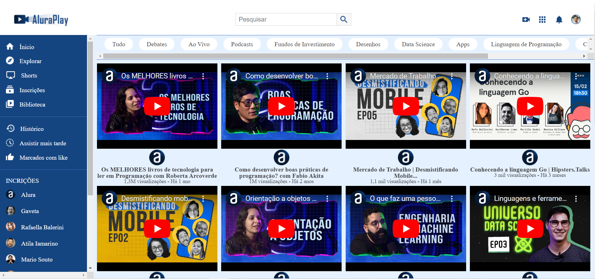

# Aluraplay 🎥

Bem-vindo ao **Aluraplay**! Uma aplicação web inovadora, inspirada no layout do YouTube, que oferece uma experiência de exibição de vídeos fluida e envolvente. Explore, aprenda e divirta-se com nossa interface amigável e moderna.

## Índice 📑

- [Visão Geral](#visão-geral)
- [Funcionalidades](#funcionalidades)
- [Tecnologias Utilizadas](#tecnologias-utilizadas)
- [Visite o Projeto](#visite-o-projeto)
- [Contato](#contato)

## Visão Geral 🌟

O **Aluraplay** é uma página web responsiva que exibe uma lista de vídeos de forma elegante e intuitiva. Utilizando as últimas tecnologias em HTML e CSS, criamos um layout flexível que se adapta a diferentes dispositivos e tamanhos de tela.

## Funcionalidades 🚀

- 🎬 **Exibição de Vídeos:** Veja vídeos embutidos diretamente na página.
- 🔍 **Interface de Busca:** Busque seus vídeos favoritos com facilidade.
- 📂 **Menu Lateral:** Navegue entre categorias e canais de maneira intuitiva.
- 📱 **Design Responsivo:** Experiência perfeita em qualquer dispositivo.

## Tecnologias Utilizadas 🛠️

- **HTML5:** Estrutura semântica e moderna.
- **CSS3:** Layout flexível com Flexbox e design responsivo.
- **Font Awesome:** Ícones atrativos e personalizados.
- **YouTube Embeds:** Integração perfeita com vídeos do YouTube.

## Visite o Projeto
Você pode acessar o site do Alura Books através deste [link]([https://.vercel.app/](https://alura-play-woad.vercel.app/)).

## Contato
Este projeto é um trabalho em andamento e faz parte da minha formação como desenvolvedor. Se você tiver sugestões ou quiser entrar em contato, pode me encontrar em:

- **Email:** fabiooprogramador@gmail.com
- **LinkedIn:** [Fabio Fernandes](https://www.linkedin.com/in/fabiogmf/)

Agradeço por visitar meu projeto e espero que goste da experiência de navegação pelo Alura Books! 🚀📚

Criado com 💙 por Fabio Fernandes
